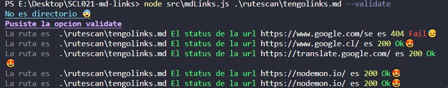
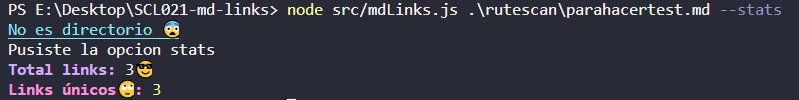

# ¡Bienvenidxs a MD-Links :sparkles: ! 
[](https://www.photopea.com/)
## Índice
  - [1. Resumen del Proyecto ✏](#1-resumen-del-proyecto-✏)
  - [2.Objetivo de la Librería](#2objetivo-de-la-librería)
  - [4. Diagrama de Flujo](#4-diagrama-de-flujo)
  - [3. Documentación 🤓](#3-documentación-🤓)
    - [Requisitos](#requisitos)
    - [Instalación desde la terminal](#instalación-desde-la-terminal)
    - [Formas de Uso ✨](#formas-de-uso-)
  - [4. Ejemplos de uso](#4-ejemplos-de-uso)

## 1. Resumen del Proyecto ✏
Librería desarrollada en node.js para verificar URL dentro de archivos con Markdown (extensión.md). Las principales funcionalidades de la librería son: 
* Arroja una lista con los links válidos e inválidos
* Nos muestra la cantidad de links encontrados, cuales son únicos y cuantos son en total

## 2.Objetivo de la Librería
Ser una herramienta que ayuda mucho, ya que, los archivos Markdown que contienen url(links) muchas veces contienen vínculos inválidos  u rotos perjudicando el valor de la información compartida. 
## 4. Diagrama de Flujo

## 3. Documentación 🤓
### Requisitos 
 Te recomiendo tener instalado: 
```sh
Node.js
```
### Instalación desde la terminal

### Formas de Uso ✨
Luego de la instalación, puedes usarla con el comando `mdsearch` en la terminal. Además, debes agregar la ruta del archivo o directorio. Te dejo unos ejemplos de uso aquí abajo.

## 4. Ejemplos de uso
```sh
src/mdLinks.js [TURUTA] [OPCIÓN]
```
### Opciones 
`--validate`
Nos muestra en consola los links, con su status. 

`--stats`
Estadística básica de los links

`--validate --stats`
Permitirá ejecutar ambas opciones.
